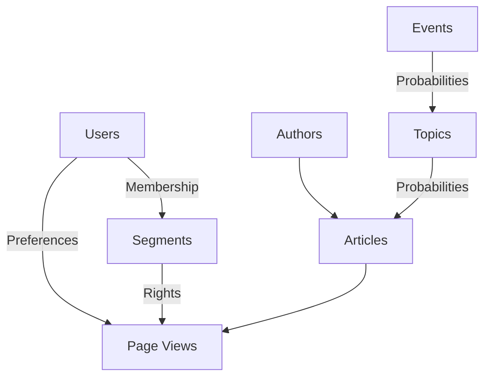

# Object Relationship Map


# Decision Process
```mermaid
  graph TD;
      A[Generate Base Objects (Authors, Topics)] --> B[Generate Events];
      B --> C[Generate Articles];
      C --> E[Generate Page Views];
      D[Generate Users] --> E;
```
