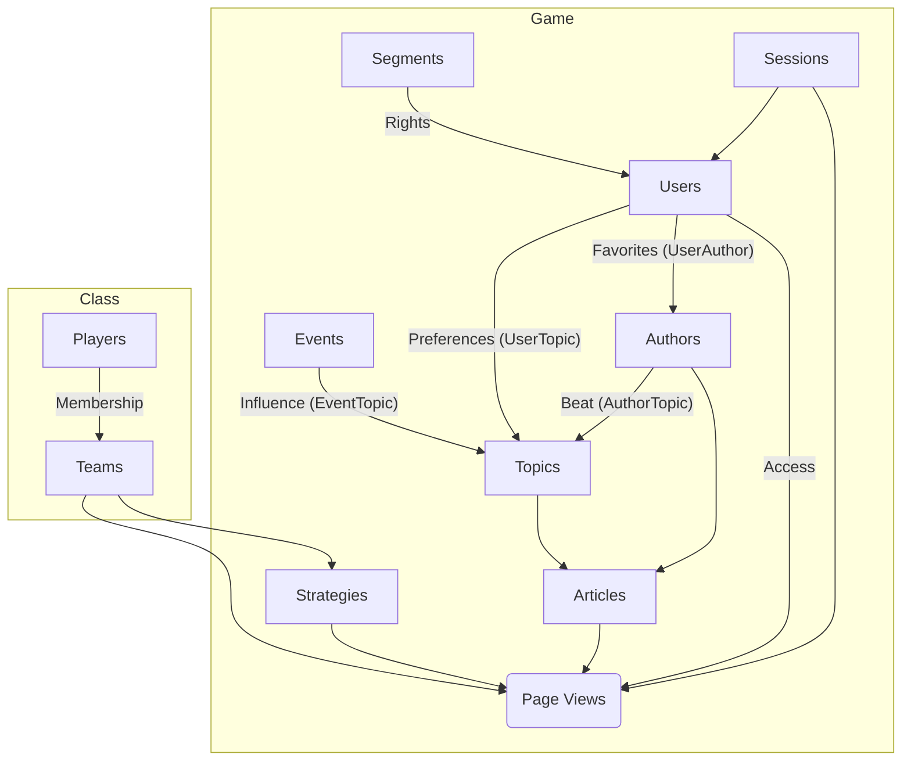
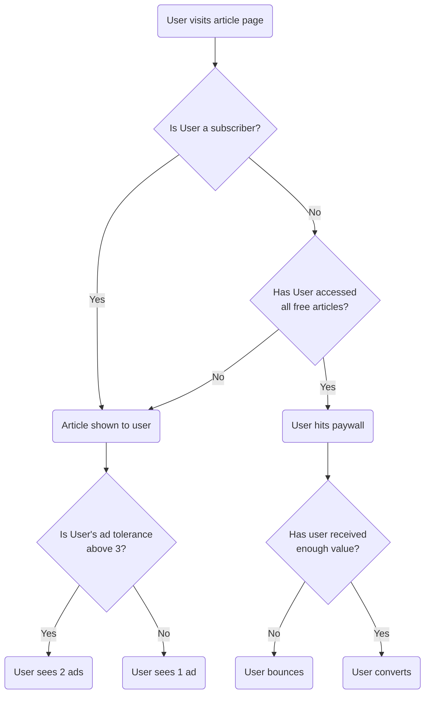

# Object Relationship Map

```mermaid
  graph TD;
      subgraph Game;
      Events -- "Influence (EventTopic)" --> Topics;
      Authors -- "Beat (AuthorTopic)" --> Topics;
      Users -- "Preferences (UserTopic)" --> Topics;
      Users -- "Favorites (UserAuthor)" --> Authors;
      Authors & Topics --> Articles;
      Segments -- Rights --> Users;
      Sessions --> Users;
      Sessions & Articles & Strategies --> PV(Page Views);
      Users -- Access --> PV;
      end;
      subgraph Class;
      Players -- Membership --> Teams;
      end;
      Teams --> PV & Strategies;
```

# Decision Process

```mermaid
  graph TD;
      A("User visits article page") --> B{"Is User a subscriber?"};
      B -- Yes --> C("Article shown to user");
      B -- No --> D{"Has User accessed<br/>all free articles?"};
      D -- Yes --> E("User hits paywall");
      D -- No --> C;
      C --> F{"Is User's ad tolerance<br/>above 3?"};
      F -- Yes --> G("User sees 2 ads");
      F -- No --> H("User sees 1 ad");
      E --> I{"Has user received<br/>enough value?"};
      I -- No --> J("User bounces");
      I -- Yes --> K("User converts");
```

